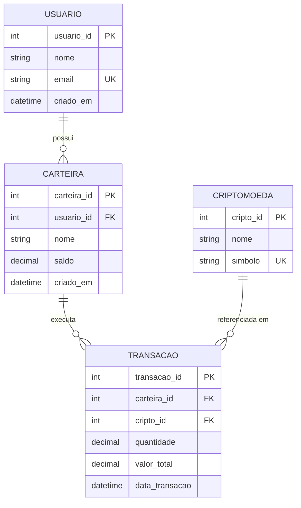

# 🪙 Crypto Wallet Relational Database

Modelagem relacional e implementação de banco de dados para gestão de carteiras digitais, controle transacional de criptoativos e auditoria financeira utilizando **MySQL 8.0**.

---

## 📐 Visão Geral do Domínio e Engenharia de Dados

O sistema gerencia o ciclo de vida transacional de criptoativos entre contas de usuários e suas respectivas carteiras digitais. A arquitetura de dados prioriza a integridade referencial estrita, normalização na **Terceira Forma Normal (3FN)**, mitigação de inconsistências em ambientes concorrentes e alta precisão numérica para suporte a unidades fracionárias.

### Destaques Arquiteturais e Decisões Técnicas
* **Precisão Financeira Estrita:** Utilização do tipo de dado `DECIMAL(18,8)` para evitar erros de arredondamento de ponto flutuante (IEEE 754) e garantir suporte à fracionabilidade nativa de criptoativos (ex: *satoshis* do Bitcoin).
* **Garantia de Propriedades ACID:** Operações de débito, crédito e histórico transacional estruturadas para suportar controle transacional isolado, mitigando *race conditions* e prevenindo inconsistências de saldo.
* **Integridade Referencial & Cascata Controlada:** Mapeamento explícito de chaves estrangeiras (`FOREIGN KEY`) com restrições de integridade que impedem a orfandade de registros operacionais e auditáveis.
* **Camada Analítica de Otimização:** Consultas estruturadas com indexação estratégica em chaves primárias e estrangeiras para extração de métricas de portfólio de alto desempenho via `JOIN` e agregações (`SUM`, `GROUP BY`).

---

## 🗺️ Diagrama Entidade-Relacionamento (ER)


---

## 🗄️ Estrutura e Dicionário de Dados

| Tabela | Responsabilidade Principal | Chaves e Restrições | Regra de Negócio Associada |
| :--- | :--- | :--- | :--- |
| **`Usuario`** | Custódia dos dados cadastrais dos titulares. | `usuario_id` (PK), `email` (UNIQUE) | Identificação única do cliente na plataforma. |
| **`Carteira`** | Mapeamento de contas vinculadas ao usuário. | `carteira_id` (PK), `usuario_id` (FK) | Um usuário pode gerenciar múltiplas carteiras. |
| **`Criptomoeda`** | Catálogo de ativos suportados pelo sistema. | `cripto_id` (PK), `simbolo` (UNIQUE) | Padronização de ativos e prevenção de duplicidade. |
| **`Transacao`** | Ledger imutável de movimentações da conta. | `transacao_id` (PK), `carteira_id` (FK), `cripto_id` (FK) | Histórico para auditoria e rastreabilidade de ordens. |.

---

## 🚀 Como Executar

### Opção 1: Ambiente Local (MySQL CLI / Workbench)

1. **Clone o repositório:**
   ```bash
   git clone [https://github.com/Lucas-san7os/crypto-wallet-database-sql.git](https://github.com/Lucas-san7os/crypto-wallet-database-sql.git)
   cd crypto-wallet-database-sql

2. **Execute os scripts na ordem sequencial:**
   ```bash
   mysql -u root -p < sql/01_schema.sql
   mysql -u root -p < sql/02_seed.sql
   mysql -u root -p < sql/03_queries.sql

### Opção 2: Teste Online (DB Fiddle)
1. Acesse o ambiente online: [DB Fiddle - Crypto Wallet SQL](https://www.db-fiddle.com/f/iEsFLGj659kxxchi7ZVhsH/0)
2. Selecione a versão **MySQL 8.0**.
3. Clique em **Run** para executar o schema e visualizar o resultado das queries analíticas.

---

## 📊 Exemplos de Consultas Analíticas

### 1. Volume Total Investido por Carteira
```sql
SELECT 
    w.nome AS carteira, 
    SUM(t.valor_total) AS total_investido
FROM Transacao AS t
JOIN Carteira AS w ON t.carteira_id = w.carteira_id
GROUP BY w.carteira_id, w.nome;
```
---
### 2. Saldo Total Custodiado por Criptoativo
```SQL
SELECT 
    c.simbolo, 
    c.nome,
    SUM(t.quantidade) AS saldo_total_custodiado
FROM Transacao AS t
JOIN Criptomoeda AS c ON t.cripto_id = c.cripto_id
GROUP BY c.cripto_id, c.simbolo, c.nome;
```

---

## 👥 Autores & Colaboradores
- **Lucas Santos**
- **Mikaely Esthefany**
- **Sara Medeiros**
- **Emilly Mendonça**